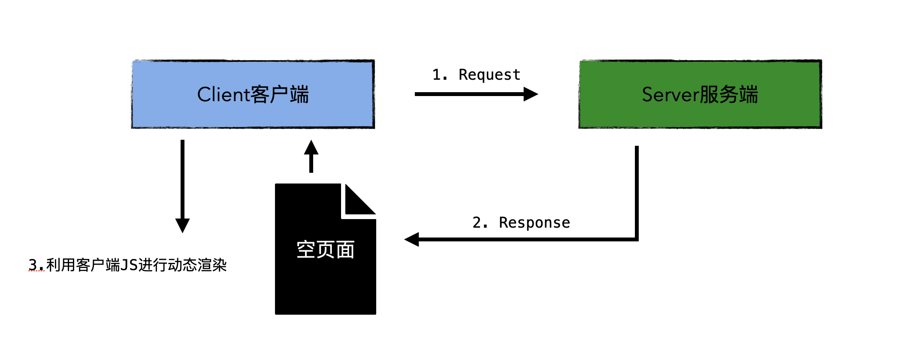
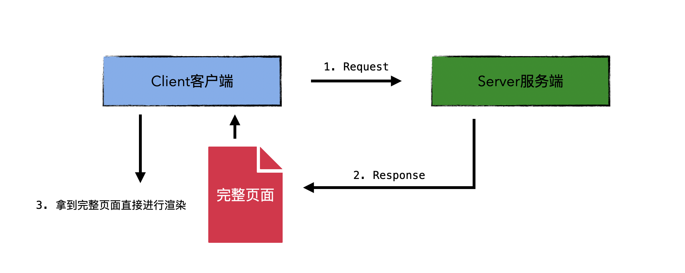

# OverView

> 在了解SSR之前, 我们先来看看CSR

### CSR（Client Side Rendering）

> 客户端渲染

客户端渲染流程如下: 



1. 客户端（比如浏览器）发送**页面请求**到服务器
2. 服务器返回相应的html页面, 但是页面中没有任何可供显示的内容
3. 由于发现页面加载了其他的资源（比如JS, CSS, IMG）, 浏览器会继续发送请求到服务器进行资源的请求
4. 服务器响应相对应的资源
5. 浏览器拿到资源以后开始执行JS（**比如假设你是用React开发的项目, 则JS中会进入React的生命周期然后生成虚拟DOM, 再映射到真实dom等一系列操作**）来进行整个页面的动态加载并渲染页面

所谓空页面, 就是一个大概如下的状态

```html
<body>
  <div id="root"></div>
  <!-- 完全依靠浏览器端能力来动态加载JS, dom的生成都是一开引入的JS,
   一开始页面中没有任何的显示元素 -->
  <script src="xxx.js"></script>
</body>
```

CSR是有缺陷的:

- 浏览器可能会长期处于白屏状态（比如你网络不太好的时候, JS资源加载比较慢, 或者是页面渲染出问题了, 都会造成DOM渲染的阻塞）
- 不利于<a href="https://zh.wikipedia.org/wiki/%E6%90%9C%E5%B0%8B%E5%BC%95%E6%93%8E%E6%9C%80%E4%BD%B3%E5%8C%96">SEO（Search Engine Optimization ==搜索引擎优化==）</a>

### SSR（Server Side Rendering）

> 服务端渲染

服务端渲染流程如下:



1. 浏览器发送请求到服务器
2. 服务器返回一个html页面, 包含完整的html内容
3. <font color=red>浏览器显示出页面</font>
4. 浏览器再次发送多个请求到服务器, 分别请求JS, IMG, CSS等
5. 服务器响应对应资源
6. 浏览器开始执行JS
7. 浏览器接管后续渲染