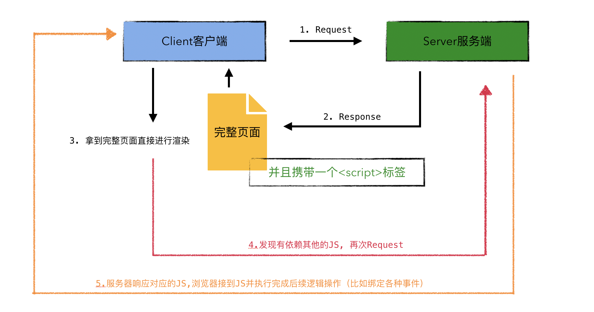

# Construct Express Project

1. 搭建express服务器, 并且控制所有的get请求都响应同一个页面
2. 配置```package.json```, 更加方便的启动服务器
    ```json
    {
      "dependencies": {
        "express": "^4.17.1"
      },
      "scripts": {
        "dev:start": "nodemon --watch src --exec node src/server"
      },
      "devDependencies": {
        "nodemon": "^2.0.6"
      }
    }

    ```
3. 安装```nodemon```监控文件的变化 

### 在服务器端渲染React组件

1. 服务器端编写React组件
    ```
    yarn add react react-dom -D
    ```
2. 由于直接运行文件会导致一些问题（比如ES6模块化在CommonJS下的兼容性问题）利用webpack打包服务器代码到dist目录
    ```
    yarn add webpack webpack-cli -D
    ```
3. 由于webpack不认识JSX的代码风格, 所以我们需要利用@babel/preset-react解析react代码
    ```
    yarn add @babel/core babel-loader @babel/preset-react -D
    ```

4. 利用externals和webpack-node-externals排除掉node_modules目录
    ```
    yarn add webpack-node-externals -D
    ```

**tips**

> 浏览器有一种机制, 当第一次请求服务器的时候, 他会默认向服务器请求一个favicon, 所以可能会有一次多的请求的问题

5. 重新配置```package.json```
  > 安装npm-run-all工具库来帮助我们一次性运行多个npm脚本

  ```json
  {
    "dependencies": {
      "express": "^4.17.1",
      "react": "^17.0.1",
      "react-dom": "^17.0.1"
    },
    "scripts": {
      // 加上npm-run-all的命令, 来让dev:start和dev:build同时运行
      // 也可以写成dev:*代表直接运行dev:后面的所有命令
      "dev": "npm-run-all --parallel dev:start dev:build",
      // 这里是监控dist目录下的server.js, 别写成src下的main.js了
      "dev:start": "nodemon --watch dist --exec node dist/server",
      "dev:build": "webpack"
    },
    "devDependencies": {
      "@babel/core": "^7.12.10",
      "@babel/preset-react": "^7.12.10",
      "babel-loader": "^8.2.2",
      "nodemon": "^2.0.6",
      "webpack": "^5.11.1",
      "webpack-cli": "^4.3.1",
      "webpack-node-externals": "^2.5.2"
    }
  }

  ```

6. 渲染页面组件的内容到id为```root```的div中

### 在浏览器端渲染组件

基于上方的代码, 我们在Home组件中绑定点击事件, 会发现当页面响应给浏览器以后, 我们绑定的事件直接失效了

```js
import React, { useState } from 'react'

export default function Home(props) {
  const [count, setCount] = useState(0);
  return (
    <div>
      <p>Hello, React Component</p>
      <button onClick={ () => setCount(count + 1) }>Click, current Value: { count }</button>
    </div>
  )
}
```

究其根本的原因是因为React注册事件是注册在document身上的, 而在服务器端我们并没有document, 所以肯定会导致事件绑定不成功, 所以我们真正的服务端渲染流程倒是应该像下面这样



同构: 为了保证浏览器能够正常执行和解析JS, 我们应当重写一份client的代码并使用webpack打包, 而重写的client代码应当保持和服务器端代码一致, 我们称之为**同构**

1. 书写客户端启动文件
2. 使用```webpack```打包**客户端code**到```public```目录中
    生成webpack.server.js 和 webpack.client.js来进行区分环境处理
3. 在服务器输出的html文件中引入js
4. 重新配置```package.json```
    ```json
    "scripts": {
      "dev": "npm-run-all --parallel dev:**",
      "dev:start": "nodemon --watch dist --exec node dist/server",
      "dev:build:server": "webpack --config webpack.server.js",
      "dev:build:client": "webpack --config webpack.client.js"
    },
    ```


为什么要使用hydrate注水来代替render, 因为服务端已经将页面渲染好了, 只是事件什么的没有添加上, 所以如果我们还要使用render, 那其实造成了多余的消耗, 得不偿失, 而hydrate注水你可以理解为他并不会使用render重新渲染界面, 而是在虚拟dom中给所有的Element绑定事件

至此, 我们的文件夹分为了三块

- client: 客户端代码
- pages: 通用组件代码
- server: 服务端代码


### 处理样式

我们需要安装两个插件:

```
yarn add mini-css-extract-plugin css-loader ismorphic-style-loader -D
<!-- ismorphic-style-loader 用来保证服务端和客户端样式的同构 -->
```

1. 利用webpack生成样式文件
2. 在页面源代码中加入一个link元素, 链接到样式文件

> 所书写的css文件倒是需要在client和server中都要引入, 因为我们要保证同构效果, 但是他们有一些小区别

- 客户端需要有完整的样式依赖, 经过```mini-css-extract-plugin```进行打包, 生成样式文件
- 服务端可以不生成样式文件, 但是最终的源代码中的样式必须和客户端的样式一致
- 服务端需要在页面源代码中引入一个link元素, 链接到样式文件